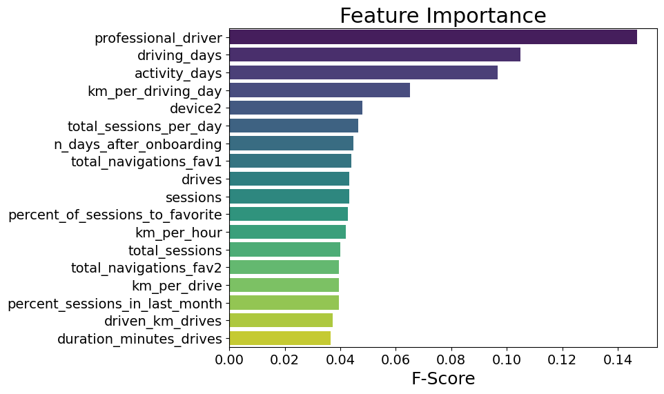

<h2>See My <strong><a href="https://davidscholtz.co.za/resume.html">Resumé</a></strong></h2>
 
<h1>Portfolio</h1>

<!--
<h2>Student Performance in Ethics Course</h2>

_24 July 2023 – (Ongoing)_

---
-->

<h2><strong>LAPD</strong>: Service Call Intelligence Dashboard</h2>

<em>27 September to 6 October 2023</em>

Policing resources are scarce, and deploying assets without intelligence can put law enforcement officers and the public at risk. Awareness of policing needs is crucial for public safety and effective law enforcement. These interactive dashboards provide critical location and time-based information enable decisionmakers to allocate resources with precision.

See the <strong>Python code</strong> for data preparation <strong><a href="https://github.com/DStrix66/lapd-dashboard/blob/main/lapd_eda.ipynb" target="_blank">here</a></strong> and the <strong>interactive dashboard on Tableau Public</strong> <strong><a href="https://public.tableau.com/app/profile/david.scholtz/viz/LAPDServiceCalls2019-2023fin/Story1" target="_blank">here</a></strong>.

---

<h2><strong>Salifort Motors</strong>: Employee Retention</h2>

<em>2-13 September 2023</em>

Salifort Motors suffers from high employee turnover, which costs the company resources in interviewing, hiring, and onboarding new employees at a higher-than-industry rate. To develop an effective retention strategy, the HR department commissioned me to analyse their data set on employee churn to gain insight into factors affecting employee turnover.

<strong>Goals</strong>: Support decision-making for developing an employee retention strategy by (i) identifying key factors affecting employees leaving the company and (ii) constructing a model that accurately predicts which individual employees are likely to leave the company.

<strong>Result</strong>: The goals were successfully achieved: (i) Key factors affecting employees leaving the company are satisfaction level, time at the company, and workload, and (ii) a model was developed with a 93% success rate in identifying employees at risk of leaving the company. Additional insights useful for developing a retention strategy were also extracted.

   
<strong>PROJECT SUMMARY</strong>

   

An EDA was conducted to clean and prepare the data set for predictive modelling. Features were extracted and selected iteratively in parallel with testing various binomial classification ML models, namely logistic regression, naïve Bayes, decision-tree, and tree-based gradient boosting machine. The latter two models were highly successful at predicting employee turnover with similar performance metrics (a precision of 97% and a recall of 92-93%). Both models identified the same factors as impacting employees leaving the company, namely satisfaction, time at the company, and workload.

   
<strong>FINDINGS</strong>

These factors (satisfaction, time at the company, and workload) do not have simple linear relationships to turnover. For example, employees within certain high and low satisfaction intervals were both more likely to leave. Thus, further investigation is required to determine the nature of the impact these factors have on employees leaving. This would be informative for developing a nuanced and effective employee retention strategy.

Additional findings useful to the goal that were not part of the initial project plan were also identified, mostly with regards to employee management. For instance, there doesn’t appear to be a clear process for promoting high-performing employees, or for developing capacity in struggling employees.

See my <strong>Python code</strong> on constructing logistic regression, naive Bayes, decision tree, and GBM models <strong><a href="https://github.com/DStrix66/salifort-motors-employee-retention.git" target="_blank">here</a></strong>.

<!--  -->

<!--   -->

---

<h2><strong>Waze</strong>: User Churn Project</h2>

<em>9 June to 1 September 2023</em>

Waze is a community driven navigation app that helps millions of users get to where they’re going through real-time road alerts and an up-to-the-moment map. High app user retention rates indicate satisfied users who repeatedly use the Waze app over time. This project develops a churn prediction model to help improve user retention, prevent churn, and grow Waze’s business.

This was a five-stage project, in which I was involved from the second stage.

   
<strong>PROJECT OUTLINE</strong>

   
   

      
<strong><em>Stage 1: Project proposal</em></strong> (not involved)

<ol type="1">
   <li>Data was imported and explored for useful user churn information</li>
   <li>A project proposal was accepted by Waze for an in-depth EDA (stage 2), statistical testing (stage 3), and predictive modelling (stages 4 & 5)</li>
</ol>
   

   
   

      
<strong><em>Stage 2: EDA</em></strong> (9-12 June 2023)

<ol type="1">
   <li>Churn rate is highest for users who didn’t drive using the app much in the last month</li>
   <li>Device types had similar churn rates</li>
   <li>Key conclusion: Statistical tests need to be run on variable classes (e.g., device used) to determine significant relationships with churn</li>
</ol>
   

   
<strong><em>Stage 3: Two-sample hypothesis test</em></strong> (24-28 June 2023)

<ol type="1">
   <li>Calculations show that iPhone users have a higher average use of the app compared to Android users</li>
   <li>However, this difference is not statistically significant</li>
   <li>Key conclusion: More marketing-relevant data is needed for statistically examining churn by device use and other variables.</li>
</ol>

   
<strong><em>Stage 4:Logistic regression analysis</em></strong> (17-20 July 2023)

<ol type="1">
   <li>Ran a binomial logistic regression with slightly better than benchmark precision but very low recall</li>
   <li>Contrary to what was expected from EDA findings, the amount of driving was the second-least-important variable for predicting churn</li>
</ol>

   
<strong><em>Stage 5: Predictive classification models</em></strong> (28 August to 1 September 2023)

<ol type="1">
   <li>Features of interest were extracted, and a random forest model and a GBM model on predicting user churn were developed and performances compared</li>
   <li>The GBM outperformed the random forest model, and it had similar levels of precision and accuracy to the logistic regression, with a much better (though still unsatisfactory) recall score</li>
   <li>The models confirmed the insufficiency of the data and the need for driver-level data collection (e.g., drive times and geographic information) and user interaction with the app (e.g., input a road hazard).</li>
</ol>

<strong>FINDINGS</strong>

It was established that the data is insufficient for reliably predicting user churn and that further granular data is needed on app usage and geography. Given the data, it could be determined that users who are professional drivers and who use the app more in a month are the biggest predictors of whether a user will churn or be retained.

See my <strong>Python code</strong> for stages 2-5 <strong><a href="https://github.com/DStrix66/waze-user-churn.git" target="_blank">here</a></strong>.

---

<h2><strong>Workplace Absenteeism</strong></h2>

<em>24 April – 3 May 2023</em>

Employee absenteeism can have a significant impact on a company's productivity, operational efficiency, and overall performance. By conducting a comprehensive analysis and developing a predictive model, this project provides support to Human Resources decision-making. The project provides valuable insights into employee absenteeism patterns and delivers actionable recommendations for businesses to optimise workforce management, enhance productivity, and improve employee satisfaction.

<strong>Key Findings and Recommendations</strong>

<ul>
    <li>Scheduled medical appointments tend not to result in excessive workplace absenteeism, whereas having unplanned medical needs is a strong predictor</li>
    <li>HR is recommended to consider interventions to improve employee health and early medical need detection, e.g.:</li>
    <ul>
        <li>scheduling regular medical check-ups at company cost</li>
        <li>driving improved health culture in the workplace (e.g., a workplace gym, canteen that serves balanced meals)</li>
    </ul>
    <li>Employees staying further from work and with more children may be offered benefits like a tax-deductible company fuel card or a partial work-from-home accommodation</li>
</ul>

See my <strong>Python code</strong> <strong><a href="https://github.com/DStrix66/waze-user-churn.git" target="_blank">here</a></strong>. 

---
