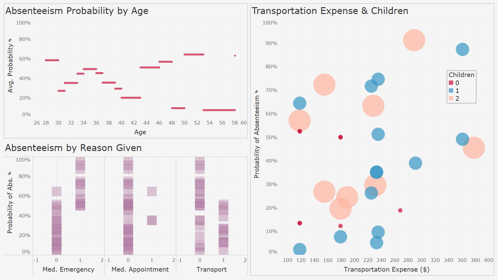

<h1>About Me</h1>

I'm a freelance data analyst with experience using statistics, machine learning algorithms, and interactive dashboards to solve business problems. My unique value consists in my ability to critically understand business needs and creatively apply data analytic solutions that are accessible to end users. My background in research and lecturing has provided me with foundational skills in critical thinking, stakeholder communication, and complex problem solving.

<h2>Education</h2>

   

      <strong>Google Advanced Data Analytics Professional Certificate</strong>  Coursera | 13 September 2023
   

   <ul>
      <li>This is what I did in the course.</li>
      <li>And then I did this.</li>
   </ul>

   

      <strong>PhD, Philosophy</strong> Uni. of Johannesburg | April 2021
   

   <ul>
      <li>Developed and <strong><a href="https://hdl.handle.net/10210/477827" target="_blank">published a dissertation</a></strong> on a new theory of the normativity of rationality &ndash; examined and approved by global experts &ndash; by critically synthesising key theoretical elements of rational-coherentism and intellectual virtue.</li>
      <li>Successfully motivated for over R450K in funding from research grants by effectively communicating the nature and purpose of my research project that is accessible and shows its relevance and impact.</li>
   </ul>

  

    <strong>MA by dissertation, Philosophy <em>cum laude</em></strong> Uni. of Johannesburg | DATE
  

  <ul>
     <li>Achieved a first-degree grade (<em>cum laude</em>) for a research dissertation defending an epistemological interpretation of Immanuel Kant's doctrine of transcendental idealism.</li>
     <li>Successfully motivated for over R96K in funding from research grants by effectively communicating the nature and purpose of my research project that is accessible and shows its relevance and impact.</li>
  </ul>

   

     <strong>BA Honours, Philosophy <em>cum laude</em></strong> Uni. of Johannesburg | DATE
   

   <ul>
      <li>Achieved a first-degree grade (<em>cum laude</em>) for an intensive Philosophy Honours programme covering themes in metaphysics & epistemology, philosophy of language, and postmodernism.</li>
      <li>Achieved a distinction for my year-long mini-dissertaion on Paul Ricoeur's hermeneutic interpretation of Edmund Husserl's phenomenology.</li>
   </ul>

  

    <strong>BA Politics, Philosophy, and Economics</strong> Uni. of Johannesburg | DATE
  

  <ul>
    <li>This is what I did in my Bachelors.</li>
  </ul>

<h2>Experience</h2>

  

    <strong>KPMG AU Data Analytics Virtual Internship on Forage</strong> KPMG AU | Sep 2023
  

   <ul>
      <li>Completed a simulation focused on advising a client on customer targeting with the Data, Analytics & Modelling team</li>
      <li>Assessed data quality and completeness in preparation for analysis</li>
      <li>Analysed data to target high-value customers based on demographics and attributes</li>
      <li>Developed dashboards to communicate findings with visuals</li>
   </ul>

  

    <strong>FTC Lecturer in Philosophy</strong> Various Universities | Jul 2013 to present
   

  <ul>
     <li>10 years of experience teaching more than 19 modules in Ethics and Philosphy at:</li>
     <ul>
        <li>Biko Centre for Bioethics (Wits Uni.)</li>
        <li>University of Johannesburg</li>
        <li>University of Pretoria</li>
        <li>University of Zululand</li>
     </ul>
     <li>Achieved over 80% success rate for all but two modules by leveraging blended learning techniques, developing tutor capacity, and using exciting experiemental and collaborative teaching techniques.</li>
     <li>When taking over low-performing modules in 2014 and 2019, I increased success rates by <strong>29 percentage points</strong> (49% to 78%) and <strong>11 percentage points</strong> (73% to 84%) respectively by transforming syllabuses to avoid previous years' pitfalls and to open-mindedly address students' contextual needs.</li>
  </ul>

  

    <strong>Doctoral Researcher</strong> Uni. of Johannesburg | Feb 2018 to Mar 2021
  

   <ul>
      <li>I researched stuff.</li>
   </ul>

<h1>Portfolio</h1>

<!--
<h2>Student Performance in Ethics Course</h2>

_24 July 2023 – (Ongoing)_

---
-->

<h2><strong>LAPD</strong>: Service Call Intelligence Dashboard</h2>

<em>27 September to 6 October 2023</em>

Policing resources are scarce, and deploying assets without intelligence can put law enforcement officers and the public at risk. Awareness of policing needs is crucial for public safety and effective law enforcement. These interactive dashboards provide critical location and time-based information enable decisionmakers to allocate resources with precision.

See the <strong>Python code</strong> for data preparation <strong><a href="https://github.com/DStrix66/lapd-dashboard/blob/main/lapd_eda.ipynb" target="_blank">here</a></strong> and the <strong>interactive dashboard on Tableau Public</strong> <strong><a href="https://public.tableau.com/app/profile/david.scholtz/viz/LAPDServiceCalls2019-2023fin/Story1" target="_blank">here</a></strong>.

---

<h2><strong>Salifort Motors</strong>: Employee Retention</h2>

<em>2-13 September 2023</em>

See the <strong>Python code</strong> on constructing logistic regression, naive Bayes, decision tree, and GBM models <strong><a href="https://github.com/DStrix66/salifort-motors-employee-retention.git" target="_blank">here</a></strong>

<!--  -->

<!--   -->

---

<h2><strong>Waze</strong>: User Churn Project</h2>

<em>9 June to 1 September 2023</em>

Waze is a community driven navigation app that helps millions of users get to where they’re going through real-time road alerts and an up-to-the-moment map. High app user retention rates indicate satisfied users who repeatedly use the Waze app over time. This project develops a churn prediction model to help improve user retention, prevent churn, and grow Waze’s business.

This was a five-stage project, in which I was involved from the second stage.

See my <strong>Python code</strong> for the latter stages <strong><a href="https://github.com/DStrix66/waze-user-churn.git" target="_blank">here</a></strong>.

   
<strong>PROJECT OUTLINE</strong>

   
   

      
<strong><em>Stage 1: Project proposal</em></strong> (not involved)

<ol type="1">
   <li>Data was imported and explored for useful user churn information</li>
   <li>A project proposal was accepted by Waze for an in-depth EDA (stage 2), statistical testing (stage 3), and predictive modelling (stages 4 & 5)</li>
</ol>
   

   
   

      
<strong><em>Stage 2: EDA</em></strong> (9-12 June 2023)

<ol type="1">
   <li>Churn rate is highest for users who didn’t drive using the app much in the last month</li>
   <li>Device types had similar churn rates</li>
   <li>Key conclusion: Statistical tests need to be run on variable classes (e.g., device used) to determine significant relationships with churn</li>
</ol>
   

   
<strong><em>Stage 3: Two-sample hypothesis test</em></strong> (24-28 June 2023)

<ol type="1">
   <li>Calculations show that iPhone users have a higher average use of the app compared to Android users</li>
   <li>However, this difference is not statistically significant</li>
   <li>Key conclusion: More marketing-relevant data is needed for statistically examining churn by device use and other variables.</li>
</ol>

   
<strong><em>Stage 4:Logistic regression analysis</em></strong> (17-20 July 2023)

<ol type="1">
   <li>Ran a binomial logistic regression with slightly better than benchmark precision but very low recall</li>
   <li>Contrary to what was expected from EDA findings, the amount of driving was the second-least-important variable for predicting churn</li>
</ol>

   
<strong><em>Stage 5: Predictive classification models</em></strong> (28 August to 1 September 2023)

<ol type="1">
   <li>Features of interest were extracted, and a random forest model and a GBM model on predicting user churn were developed and performances compared</li>
   <li>The GBM outperformed the random forest model, and it had similar levels of precision and accuracy to the logistic regression, with a much better (though still unsatisfactory) recall score</li>
   <li>The models confirmed the insufficiency of the data and the need for driver-level data collection (e.g., drive times and geographic information) and user interaction with the app (e.g., input a road hazard).</li>
</ol>

<strong>FINDINGS</strong>

It was established that the data is insufficient for reliably predicting user churn and that further granular data is needed on app usage and geography. Given the data, it could be determined that users who are professional drivers and who use the app more in a month are the biggest predictors of whether a user will churn or be retained.

 <!-- style="width:128px;height:128px;" -->

 <!-- style="width:128px;height:128px;" -->

---

<h2><strong>Workplace Absenteeism</strong></h2>

<em>24 April – 3 May 2023</em>

Employee absenteeism can have a significant impact on a company's productivity, operational efficiency, and overall performance. By conducting a comprehensive analysis and developing a predictive model, this project provides support to Human Resources decision-making. The project provides valuable insights into employee absenteeism patterns and delivers actionable recommendations for businesses to optimise workforce management, enhance productivity, and improve employee satisfaction.

<strong>Key Findings and Recommendations</strong>

<ul>
    <li>Scheduled medical appointments tend not to result in excessive workplace absenteeism, whereas having unplanned medical needs is a strong predictor</li>
    <li>HR is recommended to consider interventions to improve employee health and early medical need detection, e.g.:</li>
    <ul>
        <li>scheduling regular medical check-ups at company cost</li>
        <li>driving improved health culture in the workplace (e.g., a workplace gym, canteen that serves balanced meals)</li>
    </ul>
    <li>Employees staying further from work and with more children may be offered benefits like a tax-deductible company fuel card or a partial work-from-home accommodation</li>
</ul>

See the <strong>Python code</strong> <strong><a href="https://github.com/DStrix66/waze-user-churn.git" target="_blank">here</a></strong>.

 <!-- style="width:128px;height:128px;" -->

---
